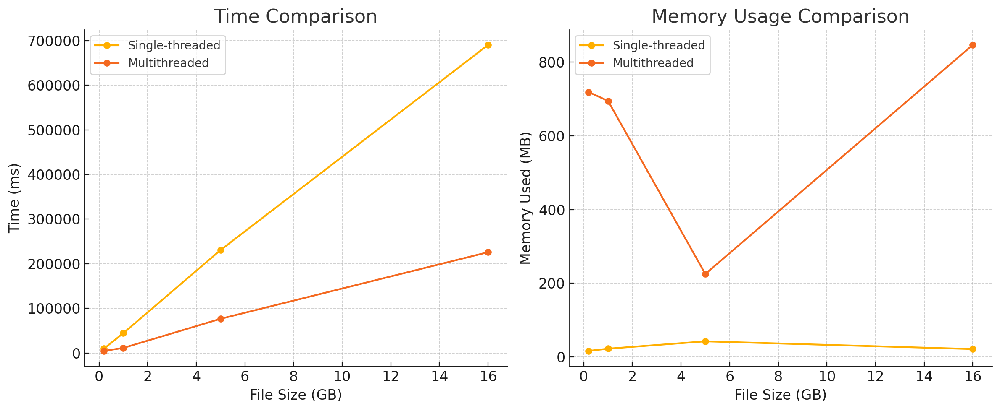

# Samchika

**Samchika** (meaning _File_ in Sanskrit) is a **re-usable**, **easy-to-use**, and **extremely fast** file processing library for the Java language.

It is built with a strong focus on **multithreading** to handle CPU-intensive file processing tasks in parallel, enabling high performance even with massive files.

---

## 🚀 Features

- 🔁 Fully multithreaded – optimized for parallel file processing.
- 🧩 Simple API – just plug in your file path and logic.
- 📊 Optional runtime stats – time taken, memory used, thread-level info.
- 🧪 Ideal for processing and analyzing **large text files** (e.g. logs, datasets).
- 🌍 Open-source friendly – contributions are welcome!

---

## 📦 Installation

### Maven

```xml
<dependency>
    <groupId>com.samchika</groupId>
    <artifactId>samchika-file-processor</artifactId>
    <version>1.0.0</version>
</dependency>
```

### Gradle
```
implementation 'com.samchika:samchika-file-processor:1.0.0'
```

## 🛠️ How to Use

### Step 1: Import the Library 

```
import com.samchika.SmartFileProcessor;
```

### Step 2: Client Code 

```
public static void main(String[] args) {
    SmartFileProcessor processor = SmartFileProcessor.builder()
        .inputPath("input.txt")         // Path to the file to be processed
        .outputPath("output.txt")       // Path to write the output
        .lineProcessor(Main::processLine) // Your business logic per line
        .displayStats(true)             // Optional: display runtime stats
        .build();

    processor.execute();
}
```

## 📈 Performance
Benchmarked against naïve BufferedReader-based implementations on files of various sizes:

✅ 200 MB

✅ 1 GB

✅ 5 GB

✅ 16 GB

Significant performance improvements were observed, especially in multi-core systems ( More than 70% performance gain ) 

The gain in time saved improves in comparison to naive code, as we increase the size of input file.  Also for huge performance gain in time, the memory used for even large files ( 16GB ) is manageable ( ~ 800 MB ).




## License
This library is licensed under the MIT License, which means you can freely use, modify, and distribute it, even in commercial applications. All we ask is that you include the original copyright notice and license text in any copy of the library or substantial portion of it.

## 💡 Inspiration

This project was inspired by:

1) Shubham Maurya, a dear friend,  who published a JavaScript library – which sparked the motivation to do something similar in Java.

2) A LinkedIn post discussing the challenges of processing large text files – which gave me the idea to solve it with an elegant API and fast multithreaded architecture.


